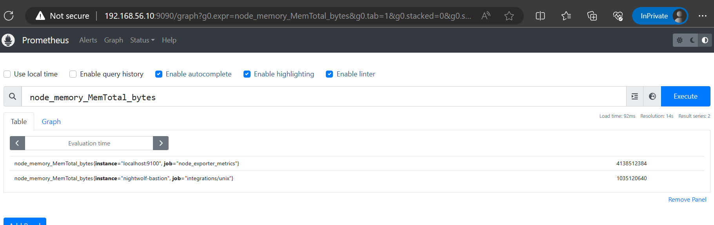
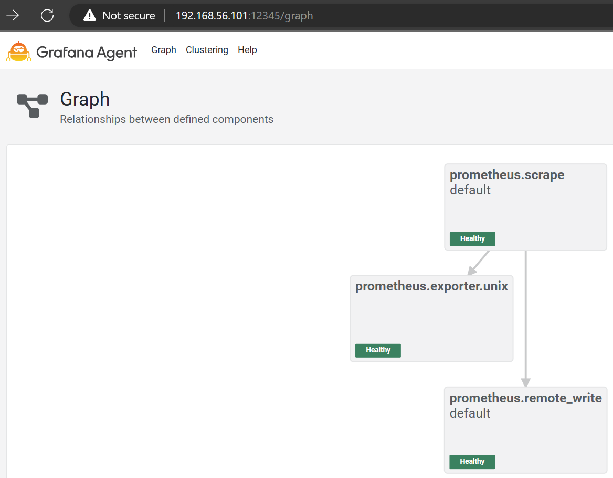

# Example of Grafana Agent in a Container

## Requirements

1. [Docker](https://docs.docker.com/engine/install/)
2. [Docker Compose](https://docs.docker.com/compose/install/)

## Guide

1. Create a `.env` file in the current directory. You can use the provided `.env.example` file as a reference.
2. Run `./deploy.sh` to deploy the Grafana Agent.

## Verification

### Prometheus

1. Open the Prometheus web UI server.
2. Choose one of the metrics from node-exporter to confirm that the metrics have been sent by the Grafana Agent.

  </img>

3. Ensure that the instance name already exists. In this case, the hostname of my server is `nightwolf-bastion`.

### Grafana Agent

1. Open the Grafana Agent web UI server.
2. Open `Graph` menu.

  </img>

3. Ensure that the topology looks like the picture above.
